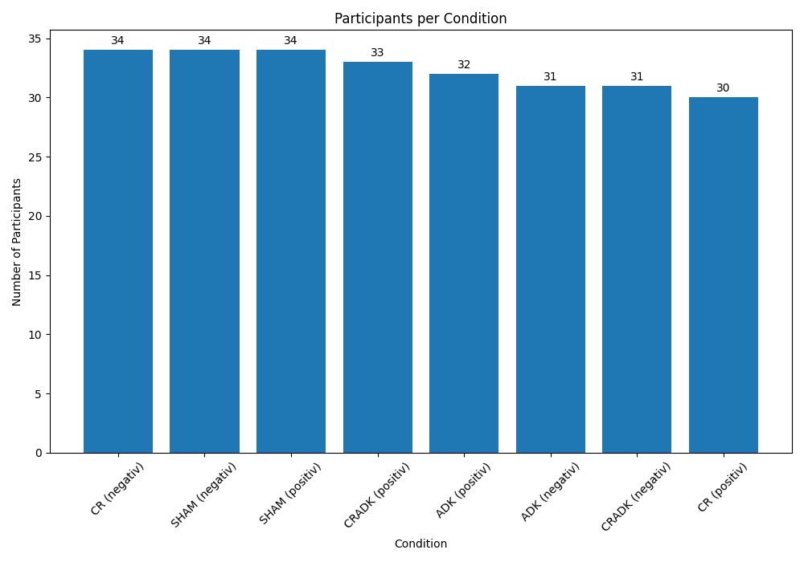
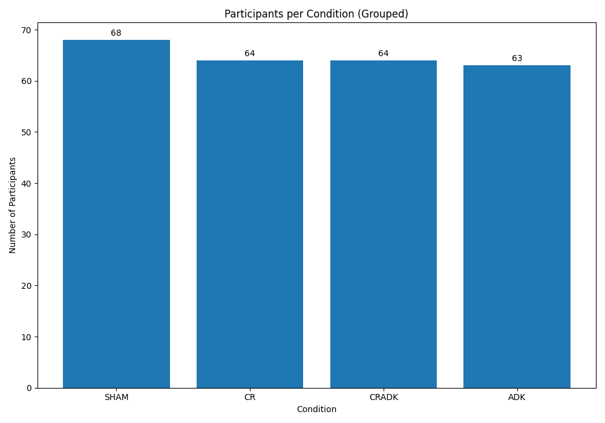

# RCT Participant Information — Summary

This document summarizes the cleaned metadata stored in `RCT_info.csv`.  

---

## Total participants

- **259 Participants**
- **253 Available Participants**

---

# Missing Participants

| No. | Participant ID | Problem                                          |
|-----|----------------|--------------------------------------------------|
| 1   | 005            | Empty folder                                     |
| 2   | 044            | No `journal.xls` file found                      |
| 3   | 074            | empty `app.csv` file                             |
| 4   | 093            | No `journal.xls` file found                      |
| 5   | 131            | No `journal.xls` file found                      |
| 6   | 467            | empty `app.csv` file                             |
| 7   | 516            | `data.txt` is empty                              |
| 8   | 641            | `data.txt` is empty                              |
| 9   | 673            | No `journal.xls` file found                      |
| 10  | 828            | Missing folder in `RCT/raw_data`                 |

---

# Participants with Missing Phase

| No. | Participant ID | Missing phases  |
|-----|----------------|-----------------|
| 1   | 115            | ei1 & latency   |
| 2   | 121            | ei2             |
| 3   | 142            | ei2             |
| 4   | 144            | ei2             |
| 5   | 147            | ei2             |
| 6   | 263            | ei2 & training  |
| 7   | 418            | ei2             |
| 8   | 471            | ei2             |
| 9   | 760            | ei2 & coping    |

---

## Participants per class

| Class      | Count |
|------------|-------|
| Healthy    | 132   |
| Depressed  | 127   |

---

## Participants with EMG measuring

- **164 participants**

---

## Participants per condition

Conditions grouped by method, combining positive & negative:

| Condition | Count |
|-----------|-------|
| CR        |  64   |
| SHAM      |  68   |
| ADK       |  64   |
| CRADK     |  63   |

---

## Age statistics

|  Min  |  Max  |  Mean  | Median |
|-------|-------|--------|--------|
|  18   |   75  |  35.16 |   29   |

---

## Data Modalities in Every Condition

|  Condition  |  ECG  |  RSP  |  EMG  |  Masseter  |  Video  |  Audio  |  Text  |
|-------------|-------|-------|-------|------------|---------|---------|--------|
| ADK         |   ✅  |   ✅  |  ✅  |     ✅     |   ✅   |   ✅    |  ✅    |
| CR          |   ✅  |   ✅  |  ✅ only 50% of participants  |     ❌     |   ✅   |   ✅    |  ✅    |
| CRADK       |   ✅  |   ✅  |  ✅ only 50% of participants  |     ❌     |   ✅   |   ✅    |  ✅    |
| SHAM        |   ✅  |   ✅  |  ✅  |     ❌     |   ✅   |   ✅    |  ✅    |

---

## Number of Phases' Files in Every Condition

|  Condition  |  Training Positive  |  Training Negative  |  Emotion Induction 1  |  Emotion Induction 2  |
|-------------|---------------------|---------------------|-----------------------|-----------------------|
| ADK         |   1117              |        1094         |          56           |          30           |
| CR          |   1200              |        1200         |          60           |          29           |
| CRADK       |   1160              |        1220         |          60           |          30           | 
| SHAM        |   1207              |        1210         |          61           |          31           |

---

## Expectation: specific trainings in data modalities per Condition

| Modality                        | CR                                        | CRADK                               | ADK                                                 | SHAM             |
| ------------------------------- | ----------------------------------------- | ----------------------------------- | --------------------------------------------------- | ---------------- |
| Audio                           | structured reading                        | structured reading                  | structured reading                                  | Control Group    |
| Video (Posture, Mime, Gesture)  | None                                      | explicit expressive display required| Expressing emotions mimically (on forehead)         | Control Group    |              
| EMG                             | None                                      | only in the 50% EMG subsample       | muscle training is the intervention; EMG in 100% ADK| Control Group    |

## CRADK vs. ADK
`CRADK`: 
1. No measurement of Masseter muscle signal.
2. Facial expressions mostly obvious on video.

`ADK`: 
1. EMG were measured on all participants and including Masseter muscle movements.
2. Facial expressions mostly happened on forehead, so expected to see those changes in EMG signal.